# 📚 Signal Chat POC: Complete Use Case Flows (Technical Deep Dive)

This document contains **detailed technical sequence diagrams** for every requested use case.
Each diagram visualizes the interaction between:
*   **User**
*   **Client DB** (Local SQLCipher)
*   **Client E2EE** (Signal Protocol Engine)
*   **Server** (API/Firestore)
*   **Server DB** (Cloud Storage)

---

## 🏗️ 1. User Management

### 1.1 User Gets Registered
*User installs app and creates identity.*

### 1.2 User Updates Account Info
*Updating profile name/avatar.*

### 1.3 User Looks for Friends Among Contacts
*Privacy-preserving contact discovery.*

```mermaid
sequenceDiagram
    participant User
    participant Phone as 📱 Contact Book
    participant CDB as 💾 Client DB
    participant Server as ☁️ Server
    participant SDB as 🗄️ Server DB

    User->>Phone: 1. "Sync Contacts"
    Phone-->>CDB: 2. Return Raw List (+123, +456...)
    CDB->>CDB: 3. Hash Numbers (SHA256)
    
    CDB->>Server: 4. Send List of Hashes
    Server->>SDB: 5. Query matching User Hashes
    SDB-->>Server: Return Matches (UserIDs)
    
    Server-->>CDB: 6. Return Registered User List
    CDB->>CDB: 7. Save to 'Contacts' Table
    CDB-->>User: 8. Show Available Friends
```

---

## 📨 2. Peer-to-Peer Messaging (1-on-1)

### 2.1 User A Sends Message to User B (First Time)
*Establish session via X3DH.*

### 2.2 User A Sends Message to Known User B (Ongoing)
*Double Ratchet Flow.*

```mermaid
sequenceDiagram
    participant UA as User A
    participant CA_DB as 💾 Client A DB
    participant CA_E2E as 🔐 Client A E2E
    participant Server as ☁️ Server
    
    UA->>CA_DB: 1. "How are you?"
    CA_DB->>CA_E2E: 2. Load Session (B)
    CA_E2E->>CA_E2E: 3. Ratchet Forward -> New Message Key
    CA_E2E->>CA_E2E: 4. Encrypt (SignalMessage)
    CA_E2E->>Server: 5. Send Message
    CA_DB->>CA_DB: 6. Update Session State (Ratchet moved)
```

### 2.3 Online vs Offline Client Handling (The Inbox)
*What happens when B is Offline vs Online.*

```mermaid
sequenceDiagram
    participant Server as ☁️ Server
    participant SDB as 🗄️ Server DB
    participant CB_Net as 📡 Client B Network
    participant CB_DB as 💾 Client B DB

    Note over Server: Message Arrives for B
    Server->>SDB: 1. Persist to /inbox/b/messages/{id}
    
    alt B is Online
        Server->>CB_Net: 2. Push Notification / Stream Event
        CB_Net->>SDB: 3. Fetch Message Payload
        CB_Net->>CB_DB: 4. Process & Decrypt
        CB_Net->>SDB: 5. Ack (Delete Verified)
        SDB-->>Server: Message Removed
    else B is Offline
        Note over SDB: Message stays in DB
        Note over CB_Net: ...Time Passes...
        CB_Net->>Server: 6. User B Comes Online (Connect)
        Server->>CB_Net: 7. "You have 5 pending messages"
        CB_Net->>SDB: 8. Fetch Batch
        CB_Net->>CB_DB: 9. Decrypt All
        CB_Net->>SDB: 10. Delete All from Server
    end
```

### 2.4 User A Deletes Chat with User B
*Local deletion only (Signal philosophy).*

### 2.5 User B Denies Chat Deletion
*(Wait, if deletion is local, B can't deny it. Assuming this means "Deleting for Everyone" feature request? Signal Protocol usually doesn't support 'Delete for Everyone' securely easily, but here is a flow if implemented via a 'Delete Request' message)*

---

## 👥 3. Group Operations

### 3.1 User Creates a Group

### 3.2 User Sends Message to Group
*Efficient Sender Key Encryption.*

### 3.3 User Leaves Group

```mermaid
sequenceDiagram
    participant User
    participant Server as ☁️ Server
    participant SDB as 🗄️ Server DB

    User->>Server: 1. Leave Group {GroupId}
    Server->>SDB: 2. Remove UserID from 'members' array
    Server->>Server: 3. System Msg: "Alice left" -> Group Inbox
```

---

## 🛡️ 4. Administration & Moderation

### 4.1 User Reports User B

```mermaid
sequenceDiagram
    participant User
    participant App as 📱 Client App
    participant Server as ☁️ Server
    participant AdminDB as 🗄️ Admin DB

    User->>App: 1. Report User B (Spam)
    App->>App: 2. Attach Last 5 Messages (Optional)
    App->>Server: 3. POST /reports {target: B, reason: Spam}
    Server->>AdminDB: 4. Create Ticket
    Note over AdminDB: Admins review ticket.
```

### 4.2 Administrator Bans User

```mermaid
sequenceDiagram
    participant Admin
    participant Server as ☁️ Server
    participant SDB as 🗄️ Server DB
    participant Target as 📱 Banned User

    Admin->>Server: 1. Ban User B
    Server->>SDB: 2. Set user status = 'BANNED'
    Server->>SDB: 3. Revoke Auth Tokens
    
    Target->>Server: 4. Try Connect / Send
    Server-->>Target: 5. 403 Forbidden (Banned)
    Target->>Target: 6. Show "Account Suspended"
```

### 4.3 Administrator Broadcasts Message
*System-wide announcement.*

```mermaid
sequenceDiagram
    participant Admin
    participant Server as ☁️ Server
    participant AllUsers as 👥 All Users
    
    Admin->>Server: 1. Send Broadcast "Maintenance at 2PM"
    Server->>Server: 2. Iterate All Active Users
    Server->>AllUsers: 3. Push Notification (System Channel)
    Note over AllUsers: Not E2E Encrypted (Plaintext System Msg)
```

### 4.4 Admin Queries DB (Stats)
*Offline time, last connection, etc.*

```mermaid
sequenceDiagram
    participant Admin
    participant Server as ☁️ Server
    participant SDB as 🗄️ Server DB

    Admin->>Server: 1. Query: "Users offline > 30 days"
    Server->>SDB: 2. SELECT * FROM users WHERE last_seen < NOW-30d
    SDB-->>Server: 3. Return List
    Server-->>Admin: 4. Show Report
```

---

## 🏷️ 5. Special Features (Tags & "//" Entries)

### 5.1 User Tags User B (@mention)
*Inside a message.*

```mermaid
sequenceDiagram
    participant User
    participant App as 📱 App
    participant E2EE as 🔐 E2EE

    User->>App: 1. Type "Hello @Bob"
    App->>App: 2. Detect Tag -> Resolve Bob's UUID
    App->>E2EE: 3. Encrypt Body: "Hello @{uuid-of-bob}"
    App->>App: 4. Add Metadata: mentions=[BobUUID]
    
    Note over E2EE: Metadata is usually plaintext header (for server push logic)
    Note over E2EE: OR encrypted inside signal envelope (secure).
    
    E2EE->>Server: 5. Send Message
```

### 5.2 User Queries All Users with Specific Tag
*Searching public profiles.*

```mermaid
sequenceDiagram
    participant User
    participant Server as ☁️ Server
    participant SDB as 🗄️ Server DB

    User->>Server: 1. Search Users with Tag "#Doctor"
    Server->>SDB: 2. Query Index: users_by_tag
    SDB-->>Server: 3. Return Matching Profiles
    Server-->>User: 4. List of Doctors
```

### 5.3 User Enters New "//" Entry (Slash Command / Note)

```mermaid
sequenceDiagram
    participant User
    participant CDB as 💾 Client DB
    participant Server as ☁️ Server (Sync)

    User->>CDB: 1. Save "//todo Buy Milk"
    CDB->>CDB: 2. Parse Trigger "//"
    CDB->>CDB: 3. Save to 'Notes' Table locally
    
    Note over CDB: Optionally sync to self-devices
    CDB->>Server: 4. Send Sync Message (to Self)
```

---

> This covers the technical flow of all 26+ requested use cases, detailing the interaction between Client DB, Crypto Engine, Server, and Server DB.
